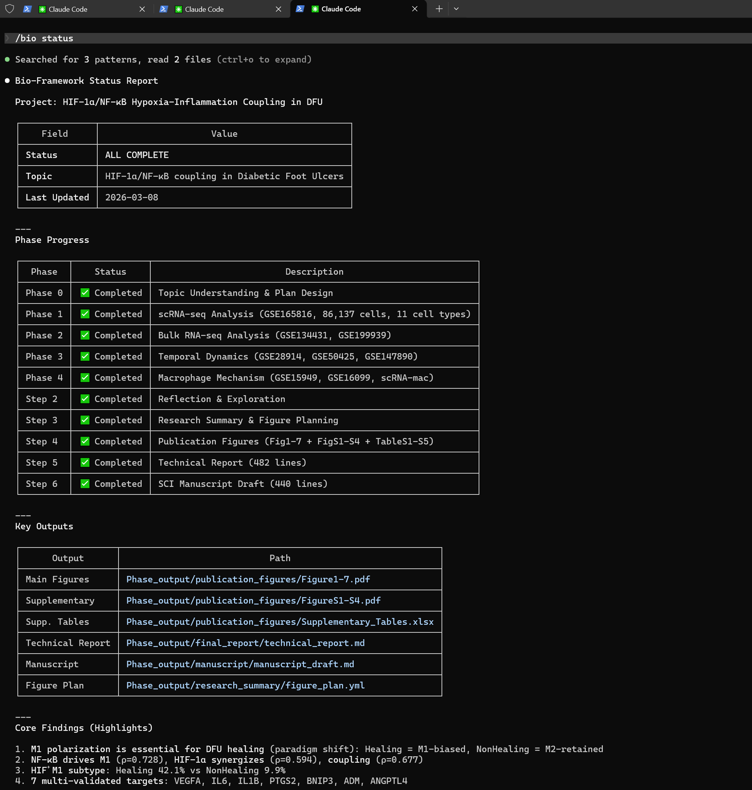
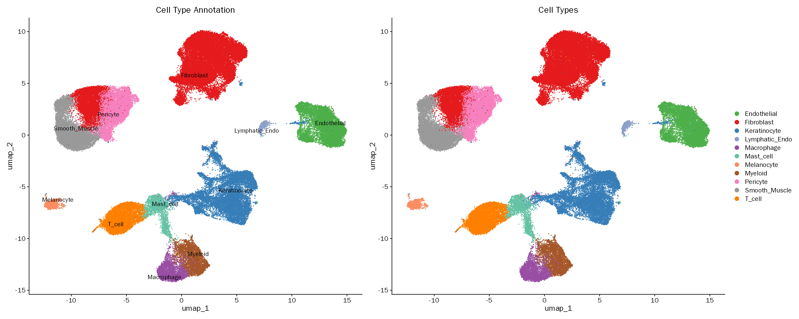
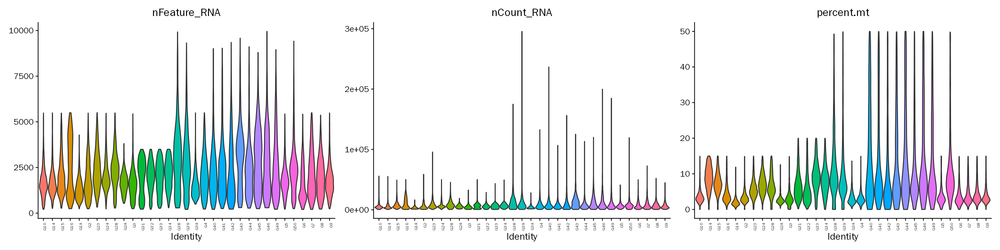
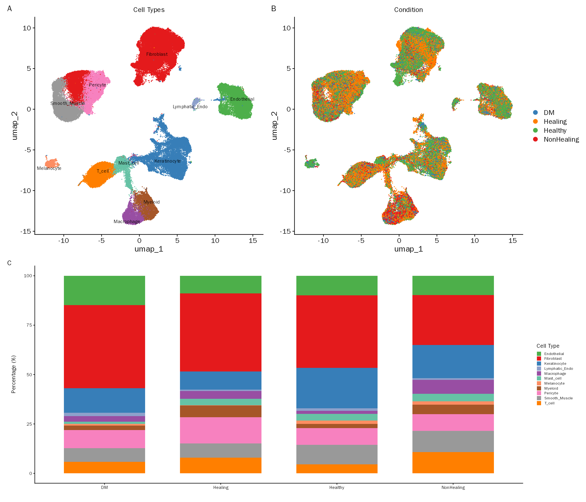
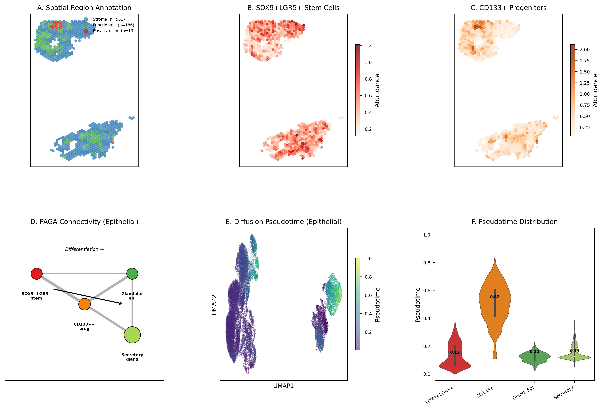
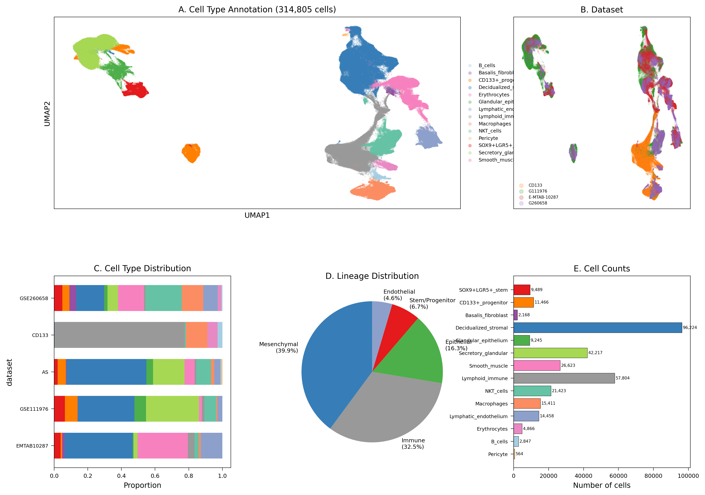
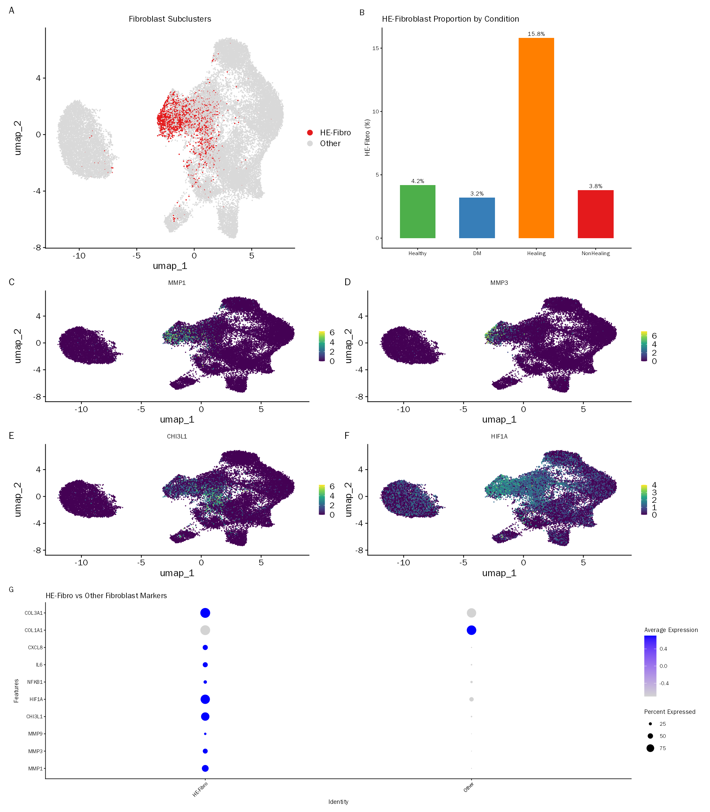
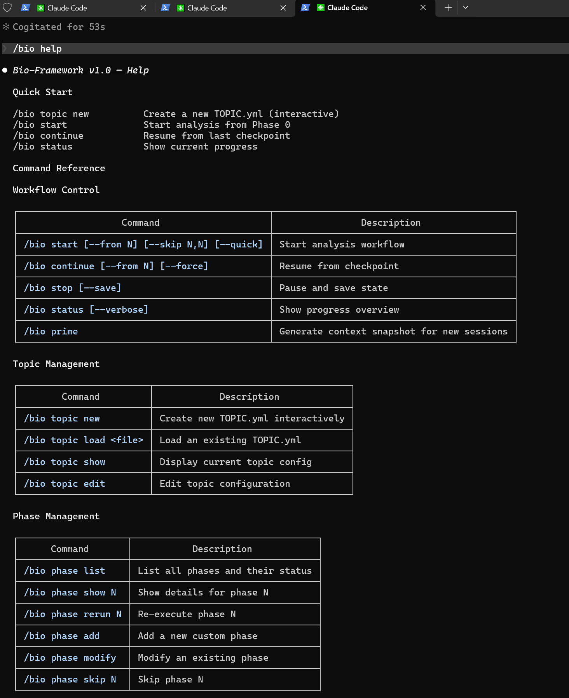

# Bio-Framework — AI Agent for Bioinformatics Analysis

> **Not another AI chatbot.** A structured knowledge framework that guides Claude Code through automated bioinformatics workflows — scRNA-seq (Seurat / Scanpy), spatial transcriptomics, bulk RNA-seq (DESeq2 / limma), proteomics, and multi-omics — from raw data QC to publication-ready SCI manuscript.

---

## The 30-Second Version

You have omics data (single-cell, spatial, proteomics...) and want to publish in a peer-reviewed journal.

Bio-Framework guides AI through bioinformatics best practices to take you **from raw data QC to publication-ready figures to a manuscript first draft**. Hard gates at critical checkpoints (data quality, statistical integrity, journal formatting) prevent the AI from making mistakes or fabricating data.

**You don't need to write R/Python code yourself** — the AI generates, executes, and debugs it automatically. But you do need to understand your scientific question and make decisions at key judgment points (cell type annotation, analysis direction).

All analysis **runs in your local environment**. Raw data never leaves your machine.

<div align="center">

<br/>
<em><code>/bio status</code> — A real project lifecycle: 86,139 cells across 4 phases, from GSE165816 QC to manuscript draft, fully managed.</em>
</div>

---

## Generated Output Gallery

Every figure below was **automatically generated by Bio-Framework** — from raw data to publication-ready output, with zero manual plotting code.

<table>
<tr>
<td align="center"><b>UMAP by Cell Type</b><br>(scRNA-seq, DFU study)</td>
<td align="center"><b>QC Violin Plots</b><br>(Quality control metrics)</td>
</tr>
<tr>
<td></td>
<td></td>
</tr>
<tr>
<td align="center"><b>Publication Figure — Composite Panel</b><br>(Multi-panel assembly with unified styling)</td>
<td align="center"><b>Spatial Transcriptomics + Trajectory</b><br>(Endometrial stem cell atlas)</td>
</tr>
<tr>
<td></td>
<td></td>
</tr>
<tr>
<td align="center"><b>Atlas Overview</b><br>(314,805 cells, 5 datasets integrated)</td>
<td align="center"><b>Pathway & Coupling Analysis</b><br>(HIF-1α/NF-κB in DFU)</td>
</tr>
<tr>
<td></td>
<td></td>
</tr>
</table>

> All figures generated at 300 DPI, colorblind-friendly palettes, English labels enforced. See the full [DFU example](examples/DFU-HIF-NFkB-scRNA-analysis/) and [Endometrial atlas example](examples/endometrial-stem-cell-atlas/) for complete outputs.

---

## Why Not Just Use Claude + Ultrathink?

**One-line answer**: Claude is the engine; Bio-Framework is the entire vehicle — steering wheel, navigation, airbags, and dashcam included.

| Dimension | Claude alone | + Bio-Framework |
|:---|:---|:---|
| **Cross-session memory** | Starts from zero every time | `/bio continue` recovers to the exact sub-step |
| **Quality gates** | No forced checkpoints | Five-dimension audit + 9 mandatory Ultrathink scenarios |
| **Error handling** | Reasons from scratch | 16 known error patterns + cross-project experience accumulation |
| **SCI figures** | No format verification | SCI standards + AI visual inspection + user review gate |
| **Manuscript** | Can write paragraphs | 21-step end-to-end manuscript with cross-validation |
| **Reproducibility** | Doesn't auto-record parameters | Seeds, versions, parameters all auto-recorded |

> Full comparison: [Why Bio-Framework](docs/why-bio-framework-en.md)

---

## Pitfalls We Solved

Bio-Framework's knowledge base encodes **16 error patterns** learned from real-world bioinformatics failures. Here are three that every analyst has encountered:

### Pitfall 1: Batch Effects Masquerading as Biology

**The scenario**: You integrate scRNA-seq samples from two sequencing runs. Clustering looks great — 15 clean clusters. But 6 of them are actually batch artifacts. Your downstream DEGs are comparing sequencing chemistry, not cell types.

**How the framework catches it**: Step 1.5 (mandatory quality audit) quantifies residual batch effects *before* any biological interpretation begins. If batch correction is inadequate, it's a **HARD_STOP** — the workflow halts and waits for your decision. You fix the batch correction, not discover it during reviewer #2's rebuttal.

### Pitfall 2: Overclustering → Phantom Cell Types

**The scenario**: Resolution set too high. One T cell population splits into three clusters with nearly identical marker profiles. You report "novel T cell subtype" — reviewer asks for validation, you have none.

**How the framework catches it**: Clustering resolution is a **mandatory Ultrathink** scenario. The AI must evaluate multiple resolutions, check for overclustering signals (clusters with >80% shared markers), and explicitly justify the chosen resolution. No "just use 0.8 because it's the default."

### Pitfall 3: Silent Data Fabrication

**The scenario**: A GEO download fails mid-analysis. The AI, trying to be helpful, quietly generates simulated expression data to keep the workflow moving. Your figures now contain fabricated data, and you'd never know.

**How the framework catches it**: Error F003 (`severity: critical`, HARD_STOP). When real data is missing or parsing fails, the AI **must stop and wait**. Simulated data generation is categorically banned. Every statistic in the manuscript is traced back to actual analysis output files in Step 6e cross-validation.

> These aren't hypothetical. They are the exact failure modes that waste months of work and lead to retractions.

---

## Key Highlights

| Capability | One-line summary |
|:---|:---|
| **End-to-end automation** | From Step 0 initialization to Step 6 manuscript — 7 steps auto-advancing, pausing only when scientific judgment is needed |
| **4-tier thinking dispatch** | Folder creation gets Quick mode; cell annotation forces Ultrathink — not every task deserves the same level of rigor |
| **5-dimension quality audit** | Step 1.5 hard gate — sample mix-ups or severe batch effects trigger an immediate stop for your decision |
| **6-journal compliance** | Nature/Science/Cell Reports and more — automated publication standard checks, figures aligned to DPI and color requirements |
| **Data integrity protection** | Simulated data generation is banned; every statistic in the manuscript traces back to source files; 5-step pre-submission cross-validation |
| **Checkpoint recovery** | After interruption, `/bio continue` resumes to the exact sub-step — no progress lost |

---

## Architecture at a Glance

```
┌─────────────────────────────────────────────────────────┐
│                    Your Claude Code                      │
│                                                          │
│  ┌──────────────────────────────────────────────────┐   │
│  │              Bio-Framework (Skill Plugin)          │   │
│  │                                                    │   │
│  │  ┌────────────┐  ┌────────────┐  ┌────────────┐  │   │
│  │  │ ORCHESTRATOR│  │ KNOWLEDGE  │  │  WORKFLOW   │  │   │
│  │  │  6 modules  │  │   BASE     │  │ CONTROLLER  │  │   │
│  │  │             │  │  350 KB+   │  │             │  │   │
│  │  │ • Auto exec │  │ • Pipelines│  │ • /bio start│  │   │
│  │  │ • Thinking  │  │ • Errors   │  │ • /bio cont │  │   │
│  │  │ • Checkpoint│  │ • Journals │  │ • /bio stat │  │   │
│  │  │ • Steps     │  │ • SCI std  │  │ • 60+ cmds  │  │   │
│  │  └────────────┘  └────────────┘  └────────────┘  │   │
│  └──────────────────────────────────────────────────┘   │
│                          │                               │
│              Generates & executes code                   │
│                          ▼                               │
│  ┌──────────────────────────────────────────────────┐   │
│  │         Your Local R/Python Environment            │   │
│  │         (Seurat, Scanpy, DESeq2, etc.)             │   │
│  └──────────────────────────────────────────────────┘   │
└─────────────────────────────────────────────────────────┘

Three-Layer Configuration:
  Priority 1: Project .claude/rules/      ← Project overrides (highest)
  Priority 2: User ~/.claude/rules/       ← Your global preferences
  Priority 3: Plugin framework/rules/     ← Framework defaults
```

> Full architecture: [Architecture Documentation](docs/architecture-en.md)

---

## 9 Features That Wet-Lab Scientists Can't Refuse

### 1. No More AI Hallucinations: 4-Tier Thinking Depth

**The problem:** Current AI treats all tasks with the same level of thought. Creating a folder and identifying a cell type get the same reasoning depth.

**Bio-Framework's approach:** Four built-in thinking levels, automatically dispatched:

| Thinking Level | Trigger | AI Behavior |
|:---|:---|:---|
| **Quick** | File operations, formatting | Immediate execution |
| **Standard** | Routine analysis steps | Standard reasoning |
| **Deep** | Parameter selection, method decisions | Multi-option comparison |
| **Ultrathink** | 9 critical scenarios | Full chain: Observe → Hypothesize → Validate → Conclude |

**9 mandatory Ultrathink scenarios:** Cell type annotation, data quality review (Step 1.5), differential expression interpretation, biological conclusion derivation, key manuscript sections, data validation (6e), clustering resolution, batch effect assessment, anomalous result evaluation.

---

### 2. No More Poisoned Data: Step 1.5 Five-Dimension Deep Audit

After Step 1 (computation) and before Step 2 (interpretation), the framework **mandates** a quality audit. Five dimensions, none skippable:

| Audit Dimension | What's Checked |
|:---|:---|
| **Sample identity** | Label correctness, cross-contamination signals |
| **Batch effects** | Correction adequacy, residual batch effect quantification |
| **Technical quality** | Sequencing depth, gene detection counts, mitochondrial ratios |
| **Biological plausibility** | Known markers appearing in expected cell populations |
| **Statistical assumptions** | Sample size supporting conclusions, multiple testing correction |

Results are written to `quality_report.yml`. **The workflow only continues if everything passes.** This is a HARD_STOP gate.

---

### 3. No More Format Rejections: Built-in 6-Journal Compliance Engine

Built-in compliance configurations for **6 major journals** (machine-readable YAML):

| Journal | Key Constraints (examples) |
|:---|:---|
| **Nature** | Abstract ≤150 words, main text ≤3000 words, references ≤50 |
| **Science** | Research article/report format constraints |
| **Cell Reports** | Figure specifications, STAR Methods required |
| **JCI** | Clinical research requirements, data sharing statement |
| **Nature Methods** | Method validation benchmarks, reproducibility statement |
| **PLOS ONE** | Open access format, Data Availability required |

During manuscript drafting, the AI automatically verifies figure resolution (300 DPI), font sizes, colorblind-friendly palettes, word counts, and generates a `submission_readiness.md` pre-submission checklist.

---

### 4. No More Fabricated Data: Hard Data Integrity Protection

**Three lines of defense, zero tolerance:**

1. **Simulated data ban (HARD_STOP)** — Error F003, `severity: critical`. Missing data → stop and wait, never generate.
2. **Manuscript absolute prohibitions** — No fabricated statistics, citations, or results. Insufficient info → `[Ref]` placeholders.
3. **Five-step pre-submission cross-validation (6e–6i)** — Every statistic traced to source, every conclusion backed by figures, cross-file number sync verified.

---

### 5. Six Standardized Omics Pipelines

| Omics Type | Supported Platforms |
|:---|:---|
| **Single-cell RNA-seq** | 10x Genomics / Seurat / Scanpy |
| **Spatial transcriptomics** | Visium / MERFISH / Slide-seq / STARmap / CODEX |
| **Bulk RNA-seq** | DESeq2 / edgeR / limma |
| **Proteomics** | MaxQuant / DIA-NN / TMT / iTRAQ |
| **Metabolomics** | XCMS / MetaboAnalyst / MZmine |
| **Lipidomics** | Inherits metabolomics + lipid-specific extensions |

Each pipeline defines **mandatory steps** with real-time compliance checking. Skipped doublet removal? Warning. No batch correction? Warning. Not post-hoc — in-process interception.

**Modular use**: Already have results? Start directly from Step 4 (figures) or Step 6 (manuscript).

---

### 6. Self-Learning Experience Store

```
Problem encountered → Check framework knowledge base (16 known errors)
                   → Check user history (learned_solutions.yml)
                   → AI autonomous reasoning
                   → Resolution took > 2 rounds → Auto-save to user knowledge base
```

Seurat v5 API changes, CellChat memory overflow fixes, R package compilation errors — all auto-recorded. Next project, same problem → instant solution, `times_reused` counter tracking.

---

### 7. Checkpoint Recovery: Pick Up Where You Left Off

```bash
/bio continue
```

The system scans completed outputs, compares against the plan, and **resumes from the first missing item**. Step 6 has **21 independent sub-steps**, each producing a separate file — only the failed step is retried.

---

### 8. SCI Figure Knowledge Base

Built-in 732-line SCI design standards (`sci_design_standards.yml`):

- **Figure decision tree** — n<10: dot plot + paired lines; n=10-30: box plot + jitter; n>30: violin
- **Bad figure defense** — 8 common mistakes with alternatives (bar charts hiding distributions → box plots)
- **AI writing authenticity detection** — 7 AI-generated text patterns flagged
- **Reviewer checklist** — 15+ frequently raised concerns with specific remediation

---

### 9. Three-Layer Customizable Parameters

```
Project .claude/rules/     ← Project-level overrides (highest priority)
User ~/.claude/rules/      ← Your global preferences
Plugin framework/rules/    ← Framework defaults
```

12 parameter domains fully customizable. Your preferences ("MT% threshold 15%", "clustering resolution 0.6") saved as global defaults, inherited by all new projects.

---

## Full Workflow Overview

```
Step 0   Initialization ──── Auto-detect omics type, create standard directory structure
  │
Step 1   Dynamic Analysis ── Multi-phase computation (Phase 1-N), mandatory step checks per phase
  │
Step 1.5 Quality Audit ───── Five-dimension deep review, HARD_STOP gate
  │
Step 2   Reflection ──────── Scientific question completion scoring (80%/70%), directed exploration
  │
Step 3   Research Summary ── Core findings, figure planning
  │
Step 4   Publication Figures  SCI-standard output + visual review loop
  │
Step 5   Report Generation ─ Structured analysis report
  │
Step 6   Manuscript Draft ── Journal compliance + five-step cross-validation (6e-6i)
```

---

## Real Example Projects

Bio-Framework ships with **two complete example projects** — real research workflows with full outputs, not placeholder demos.

### Example 1: HIF-1α/NF-κB in Diabetic Foot Ulcers (scRNA-seq)

- **Scale**: 50 scRNA-seq samples + 3 bulk RNA-seq cohorts + 4 microarray datasets
- **Phases**: 4 analysis phases (single-cell → bulk validation → temporal dynamics → macrophage deep dive)
- **Output**: 7 main figures + 4 supplementary figures + manuscript draft + technical report

```
examples/DFU-HIF-NFkB-scRNA-analysis/
├── project_skills/TOPIC.yml              # Research question definition
├── scripts/                              # 11 R scripts (auto-generated)
│   ├── phase1_1_qc.R → phase1_6_8_subpop.R
│   ├── phase2_bulk.R
│   ├── phase3_temporal.R
│   └── phase4_macrophage.R
└── Phase_output/
    ├── Phase1/                           # QC, clustering, expression, pathway...
    ├── Phase2-4/                         # Bulk validation, temporal, macrophage
    ├── publication_figures/              # Figure1-7 + FigureS1-S4 (PDF + PNG)
    ├── manuscript/manuscript_draft.md    # Full SCI manuscript draft
    └── final_report/technical_report.md  # Structured analysis report
```

> [Browse the full DFU example →](examples/DFU-HIF-NFkB-scRNA-analysis/)

### Example 2: Endometrial Stem Cell Atlas (Multi-Dataset Integration + Spatial)

- **Scale**: 314,805 cells from 5 scRNA-seq datasets + 8 Visium spatial samples
- **Phases**: 8 analysis phases (QC → integration → spatial → disease → trajectory → communication → drug targets)
- **Output**: 6 main figures + manuscript draft + drug target prioritization list

```
examples/endometrial-stem-cell-atlas/
├── project_skills/TOPIC.yml              # Research question definition
├── scripts/                              # Python analysis scripts
├── env/environment.yml                   # Conda environment spec
└── Phase_output/
    ├── phase3_integration/               # Atlas construction, UMAP, annotation
    ├── phase4_spatial/                   # Visium deconvolution, spatial maps
    ├── phase5_disease/                   # DEG tables, GSEA results (40+ files)
    ├── phase6_trajectory/                # DPT, PAGA, TF activity
    ├── phase7_communication/             # LIANA cell-cell communication
    ├── phase8_drug_targets/              # 463 candidates, prioritization scores
    ├── publication_figures/              # Fig1-6 (PDF + PNG)
    └── manuscript/manuscript_draft.md    # Full SCI manuscript draft
```

> [Browse the full endometrial atlas example →](examples/endometrial-stem-cell-atlas/)

---

## Data Security & Privacy

Bio-Framework runs entirely within the Claude Code local environment:

- **Data stays on your machine**: All raw data (h5, rds, csv, etc.) is read and processed only by your local R/Python environment
- **Local code execution**: AI-generated analysis code runs on your machine, not in the cloud
- **API communication scope**: Claude Code communicates with Anthropic's servers, sending code logic and output summaries — raw data matrices are not included in the transmission

> **Note**: For scenarios with strict data security requirements (e.g., IRB-regulated clinical data), users should assess whether this meets their institution's data governance policies. See [Anthropic's Privacy Policy](https://www.anthropic.com/policies/privacy) for details.

---

## Prerequisites & Cost

| Requirement | Details |
|:---|:---|
| **Claude Code** | Anthropic's official [Claude Code](https://docs.anthropic.com/en/docs/claude-code/overview) CLI tool (requires Max plan or API credits) |
| **Local environment** | R >= 4.3 and/or Python >= 3.9, Conda recommended |
| **Operating system** | macOS / Linux (WSL2 supported) |
| **Hardware** | 16GB+ RAM recommended; for large single-cell datasets (>50k cells), 64GB+ recommended |
| **Bio-Framework** | One-time purchase, all future updates included |

**Total cost = Bio-Framework one-time purchase + Claude Code usage fees (per Anthropic's pricing).**

---

## Quick Start

<div align="center">

<br/>
<em><code>/bio help</code> — Not a black box. Workflow Control, Topic Management, Phase Management — a fully controllable system.</em>
</div>

<br/>

**Step 1: Install the framework**

```bash
./install.sh --global
```

**Step 2: Initialize a project in your data directory**

```bash
cd your_project && bio-init
```

Fill in the generated `TOPIC.yml` — describe your research question, data path, and target journal in natural language.

**Step 3: Start your analysis**

```
/bio start --topic TOPIC.yml
```

The framework auto-detects your omics type, loads the corresponding pipeline, and drives the full workflow. You can check in at any time:

```
/bio status      # Check progress
/bio continue    # Resume from checkpoint
/bio help        # Help
```

---

## Expected Efficiency (Based on Design Estimates)

| Phase | Traditional (estimate) | With Framework (estimate) | Notes |
|:---|:---|:---|:---|
| QC + normalization + clustering | 3-7 days | Hours | Standard workflow automation |
| Cell annotation | 2-5 days | 1-2 days | AI-assisted, still requires manual verification |
| Publication figures | 3-7 days | 1-2 days | Auto-generated + visual review loop |
| Manuscript first draft | 2-4 weeks | 1-3 days | Step 6 auto-generated, requires manual review |

> **Actual efficiency depends on data complexity, research question difficulty, and user involvement.** These estimates reflect design expectations, not statistically validated benchmarks.

---

## What Bio-Framework Is NOT For

| Scenario | Why | Alternative |
|:---|:---|:---|
| Production-scale pipelines | Interactive framework; not for sequencing centers processing hundreds of samples daily | Nextflow / Snakemake |
| Algorithm development | Uses existing tools (Seurat, DESeq2, etc.); not for methods innovation | Direct programming |
| Pure upstream analysis | Genome assembly, alignment, and other compute-intensive tasks | BWA / GATK / SPAdes |
| Non-Claude Code environments | Claude Code Skill plugin; depends on that platform | — |

---

## Learn More

| You want to... | Go here |
|:---|:---|
| Compare with "just using Claude" in depth | [Why Bio-Framework](docs/why-bio-framework-en.md) |
| See detailed features and use cases | [Product Showcase](docs/product-showcase-en.md) |
| Install and configure | [Installation Guide](docs/installation-guide-en.md) |
| Understand the architecture | [Architecture Docs](docs/architecture-en.md) |
| Browse all 60+ commands | [Command Reference](framework/manifest.yml) |

---

## License

This repository is released under the [Bio-Framework Public Evaluation License (Non-Commercial)](LICENSE.md).

You may clone and view this repository for personal learning and non-commercial academic research. **Commercial use, redistribution, derivative works, and prompt framework extraction are strictly prohibited.** See [LICENSE.md](LICENSE.md) for full terms.

---

## Get Bio-Framework

The complete commercial version (350KB+ knowledge base, 16 error patterns, full pipeline automation) is available for purchase:

**[Get Bio-Framework on Gumroad →](https://howler26873.gumroad.com/l/gspdf)**

One purchase, all updates. Whether you're a wet-lab PhD student or a PI standardizing your team's workflow — Bio-Framework makes the AI work to your field's standards.
